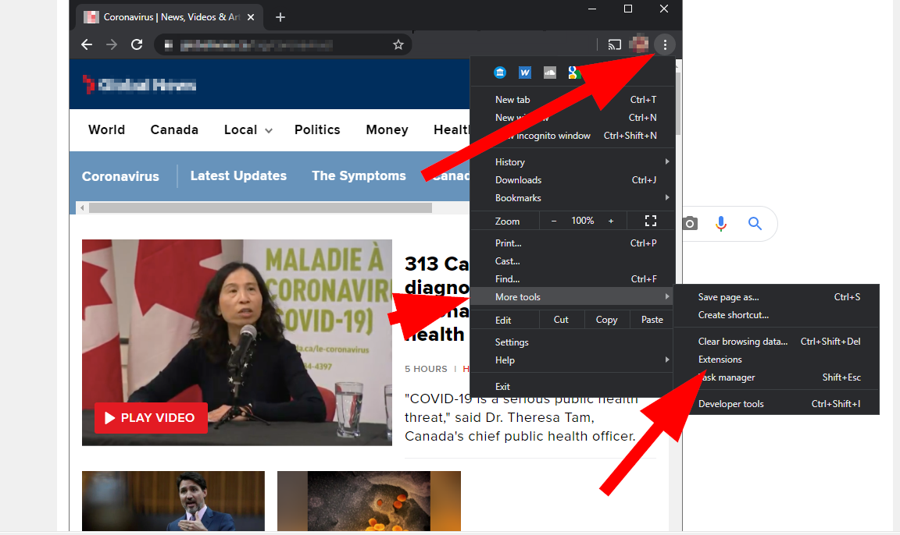
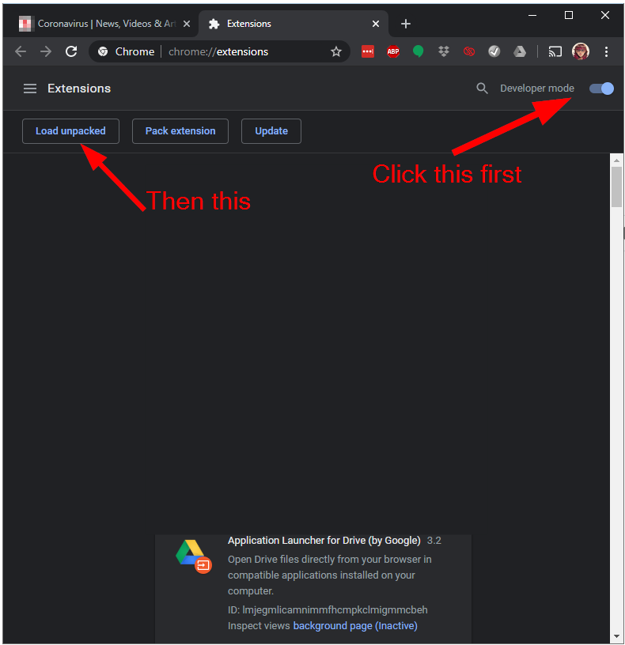
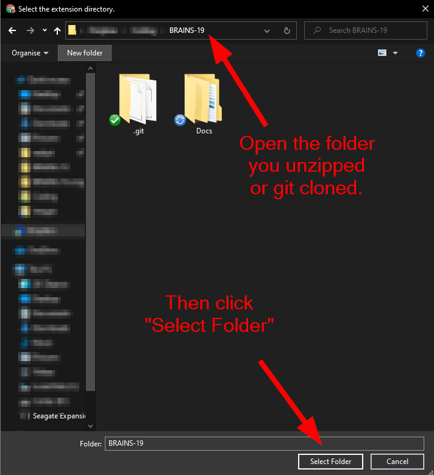
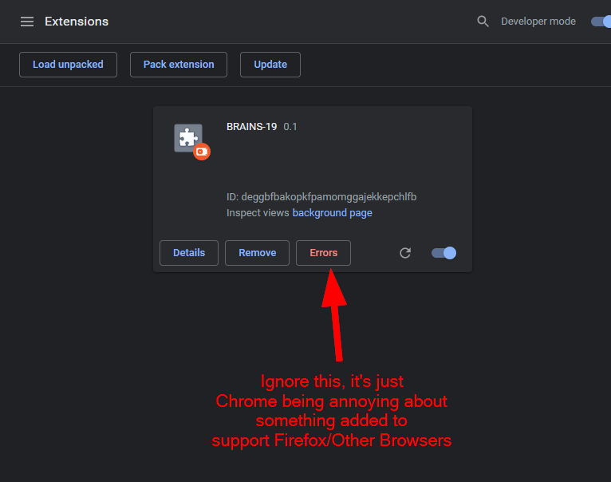
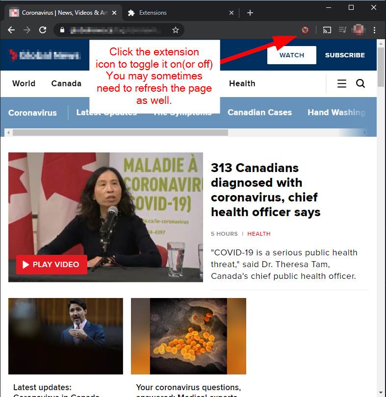
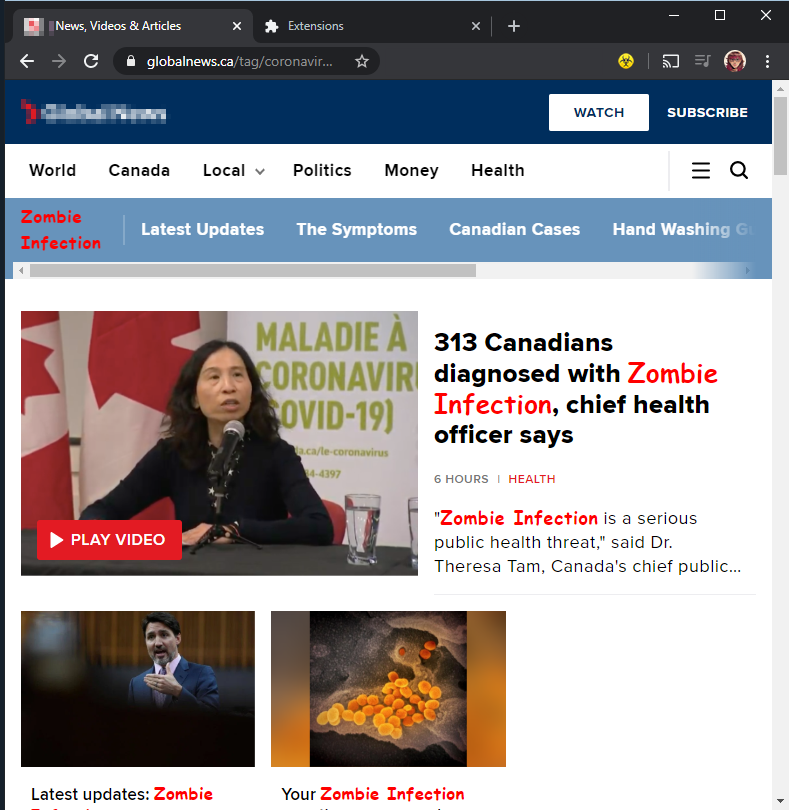

# BRAINS-19

Replaces mentions of COVID-19 or Coronavirus on a webpage with "Zombie Apocalypse" or "Zombie Infection" instead.

It's a very simple extension done quickly by someone who never made one. 

Suggested by one Sarah Sawler on Twitter(https://twitter.com/SarahSawler/status/1238092065864585217) to lighten
the thick atmosphere with a bit of dark zombie humour.

THis has been submitted to the Chrome Web Store for review, but in the mean time, you can install this in your browser via sideload.
 
## Installation: 

### Firefox

Easy! Visit this in your Firefox Browser and click "Add to Firefox"

https://addons.mozilla.org/en-US/firefox/addon/brains-19

### Google Chrome

If and until Google approves it, it needs to be sideloaded, which is a bit of a pain but not that difficult.

 * First, either download the zip file from [this link](https://github.com/raegun2k/BRAINS-19/archive/master.zip) and unzip it (in windows, right click the zip file and select "Extract All")  or git clone into a location you can find it.

 * Next click the 'hamburger menu in Chrome and select More Tools -> Extensions

 * Activate Developer Mode by flicking the switch in the top right. It should show you a "Load unpacked" button. Click that.

 * Navigate to where you unzipped or cloned the extension to. *You want to actually be in the extension folder.* Then click the "Select Folder" button.

 
 * Ignore any errors you might get (Chrome gets persnickety about things added to make this work on other browsers too). If you don't get errors, great! Make sure the extension is enabled with the little "switch" toggle switched to the right.

 
### Microsoft Edge (Chrome based)

Instructions essentially the same as Chrome, just go to the [...] menu, and click Extensions. The Developer mode toggle will be on the lower left. Load unpacked at the top right. 

## Using the extension. 
 
 You should see an extension icon in the top of your browser that initially looks greyed out with a red line across. Click that to turn it into a yellow biohazard icon and the page you're looking at should update with the desired zombie-like changes. If it doesn't, try refreshing the page. Now every page you visit will show the same until you click that little extension icon again to disable the extension.

 
 
 # WARNING
 
 This extension WILL overwrite everything, including possible form fields. DISABLE IT IF YOU NEED TO WRITE SOMETHING ABOUT COVID SOMEWHERE OTHERWISE IT MAY OVERWRITE WHAT YOU'RE WRITING. I TAKE NO RESPONSIBILITY FOR RUINED HOMEWORK OR DOCUMENTATION.

# Known issues

 * <del> Tickers or lazy loaded content may not be captured. Working on it.</del>  *fixed in 0.2*
 * <del> Sometimes you need to refresh the page after enabling.</del>  *fixed in 0.2*
 * <del> It may overwrite form fields.</del>  *fixed in 0.2*
 * Google rejected the extension. Resubmitting. For now, continue to side load.

## Credentials ##

**Developed By**       Rae O'Neil

**Website:**           https://github.com/raegun2k, https://gammarae.design

**Stable tag:**        1.0.0  

**License:**           MIT License 

**License URI:**       https://github.com/raegun2k/BRAINS-19/blob/master/LICENSE
